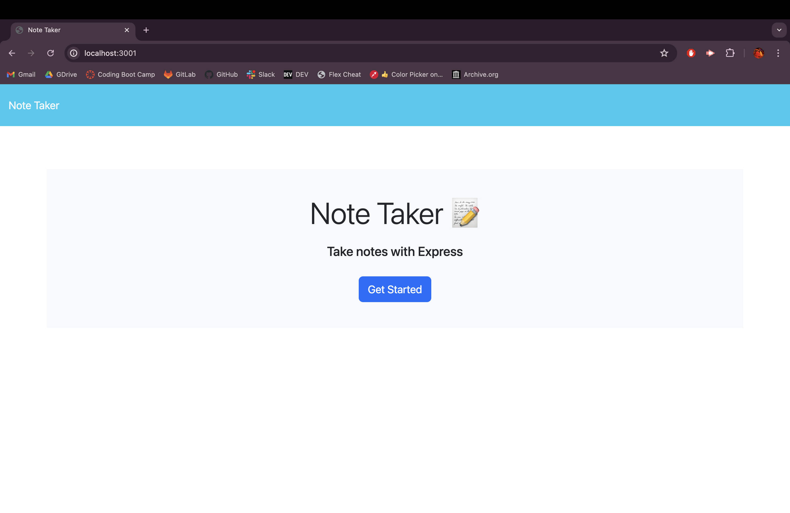
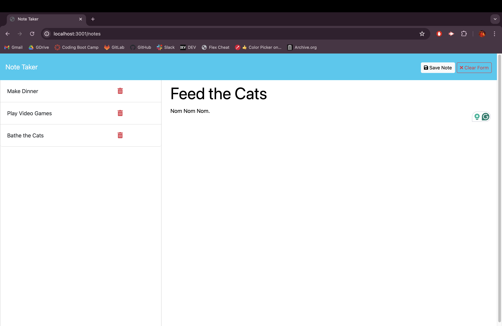

# 📋 Quick Notes

[](https://github.com/trishamasbate)
[](https://choosealicense.com/licenses/mit/)


## 📃 Description:
**Quick Notes** is a streamlined note-taking application designed to help small business owners organize their thoughts and manage tasks efficiently. With an intuitive interface, users can easily write, save, and access notes, ensuring that important information is always at their fingertips.

Features:

  **Welcome Page**: Start your note-taking journey from a welcoming landing page with a clear link to the main notes page.

  **Notes Page**: View all your existing notes in a convenient left-hand column. The right-hand column provides empty fields to create a new note.

  **Note Creation**: Enter a title and text for your new note. A "Save Note" button allows you to store the note, while a "Clear Form" button lets you start over.

  **Saving Notes**: Saved notes instantly appear in the left-hand column for easy access, and navigation buttons streamline the process.

  **Note Viewing**: Click on any existing note to view its details in the right-hand column. A "New Note" button appears, allowing you to quickly start writing a new note.

  **Effortless Navigation**: Switch between viewing and creating notes seamlessly with intuitive navigation options.

This simplifies the process of note-taking, making it an indispensable tool for managing tasks and ideas in a small business setting.

## 📌 Table of Contents
- [📋 Quick Notes](#-quick-notes)
  - [📃 Description:](#-description)
  - [📌 Table of Contents](#-table-of-contents)
  - [🔎 User Story](#-user-story)
  - [✅ Acceptance Criteria](#-acceptance-criteria)
  - [💡 Usage Instructions](#-usage-instructions)
  - [🎞️ Walkthrough Video:](#️-walkthrough-video)
  - [📸 Screenshots:](#-screenshots)
    - [🟢 Landing Page](#-landing-page)
    - [🟢 Notes Page](#-notes-page)
  - [📲 Installation Process (GitHub Repository)](#-installation-process-github-repository)
  - [🗝️ Resources](#️-resources)
  - [❓ Questions](#-questions)
  - [🪪 License](#-license)

## 🔎 User Story
```md
AS A small business owner
I WANT to be able to write and save notes
SO THAT I can organize my thoughts and keep track of tasks I need to complete
```

## ✅ Acceptance Criteria
```md
GIVEN a note-taking application
WHEN I open the Note Taker
THEN I am presented with a landing page with a link to a notes page
WHEN I click on the link to the notes page
THEN I am presented with a page with existing notes listed in the left-hand column, plus empty fields to enter a new note title and the note’s text in the right-hand column
WHEN I enter a new note title and the note’s text
THEN a "Save Note" button and a "Clear Form" button appear in the navigation at the top of the page
WHEN I click on the Save button
THEN the new note I have entered is saved and appears in the left-hand column with the other existing notes and the buttons in the navigation disappear
WHEN I click on an existing note in the list in the left-hand column
THEN that note appears in the right-hand column and a "New Note" button appears in the navigation
WHEN I click on the "New Note" button in the navigation at the top of the page
THEN I am presented with empty fields to enter a new note title and the note’s text in the right-hand column and the button disappears
```

## 💡 Usage Instructions
  **✨Click on this link deployed to Render:** [Quick Notes](https://quick-notes-lt9r.onrender.com/)

  **Using the GitHub Repository:**
1.	Locate and navigate to the directory that contains the `server.js` file within your editor.
2.	Launch an integrated terminal directly from your editor and execute the command `node server.js`.
3.	Navigate the deployed application at the live URL as directed by the prompt.
4.	Upon successfully providing and saving the notes, user inputs in `db.json` will be automatically generated.


## 🎞️ Walkthrough Video:
[Click To Watch Some Magic!](https://youtu.be/Mrl0en9u79c?si=I1YVnyPL7Ql3IWQ3)

## 📸 Screenshots:
### 🟢 Landing Page

### 🟢 Notes Page


## 📲 Installation Process (GitHub Repository)
1. Clone the repository: [Quick Notes](https://github.com/trishamasbate/quick-notes)
2. Install the following: 
   - Express.js [Version 4.16.4](https://www.npmjs.com/package/express/v/4.16.4) 
   - UUID [Version 3.4.0](https://www.npmjs.com/package/uuid)
3. Open the cloned repository in the terminal.
4. Navigate the deployed application through the live URL.


## 🗝️ Resources
- Dynamic JavaScript
- License Badge: [Shields.io](https://shields.io/)
- [Render](https://render.com/)
- [Express.js Version 4.16.4](https://www.npmjs.com/package/express/v/4.16.4) 
- [UUID Version 3.4.0](https://www.npmjs.com/package/uuid)
- [Visual Studio Code](https://code.visualstudio.com/)


## ❓ Questions
Contact the author with any questions!<br>
Github link: [trishamasbate](https://github.com/trishamasbate)<br>
Email: trisha.masbate@gmail.com

## 🪪 License
This project is [MIT](https://choosealicense.com/licenses/mit/) licensed.<br />

Copyright © 2024 [TRISHA MASBATE](https://github.com/trishamasbate)
  
<hr>
<p align='center'><i>
All the best! 🤟🏻 TRISHA MASBATE
</i></p>
  
